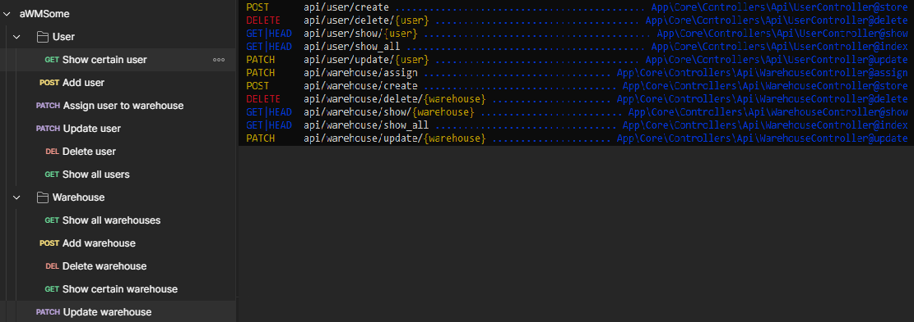

## Setup requirements:

- [XAMPP - 4.2.4 / PHP 8.2.4](https://sourceforge.net/projects/xampp/files/XAMPP%20Windows/8.2.4/xampp-windows-x64-8.2.4-0-VS16-installer.exe)
- [PHP Composer - 2.5.7](https://getcomposer.org/Composer-Setup.exe)
- [Node.js - 18.16.0](https://nodejs.org/dist/v18.16.0/node-v18.16.0-x64.msi)

## Setup

1. Install XAMPP.
2. Instal PHP Composer with php path set.
3. Install Node.js.
4. Put this repository to %xampp_localization%\htdocs.
5. Run XAMPP and start Apache and MySQL modules.
6. Run 3 instances of CMD in repository directory as Administrator.
7. Type:
      php artisan serve
      npm run dev
      php artisan migrate --seed
8. Go to your browser and open "localhost:8000".
9. You are all set to run my application!

## Test environment 

- Email:   Admin@gmail.com
- Password:   Admin

## About

This application is simple university project which supposed to be WMS at first but then I decided that I will focus on IAM module and a little bit of WMS. It was supposed to implement Clean Onion Architecture which was really hard to achieve. I wanted to show possibilities of PHP and Laravel framework. I dropped it and started a new on based on my current experience becouse I made tons of mistake at the beginning. Enjoy

## API routes

## License

The Laravel framework is open-sourced software licensed under the [MIT license](https://opensource.org/licenses/MIT).
